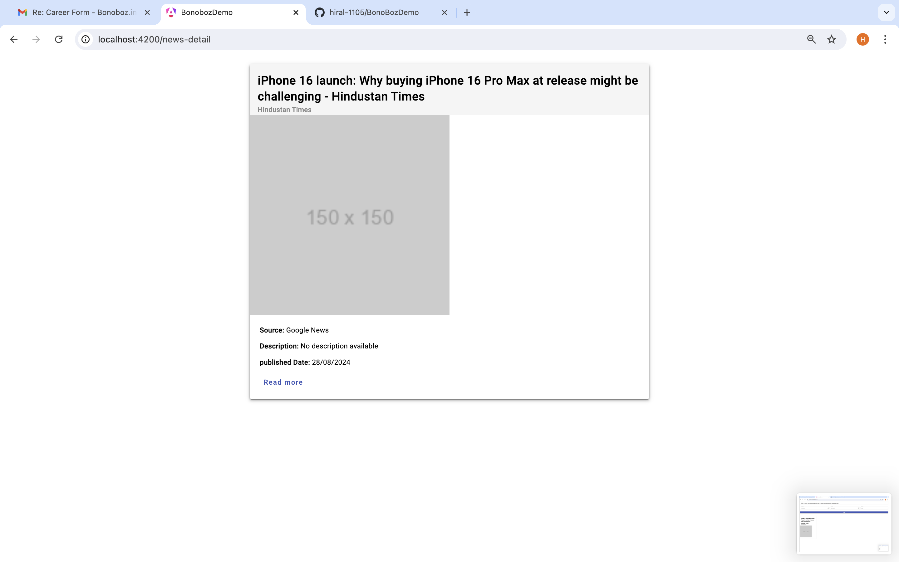

# BonobozDemo

This project was generated with [Angular CLI](https://github.com/angular/angular-cli) version 17.3.6.

## Development server

Run `ng serve` for a dev server. Navigate to `http://localhost:4200/`. The application will automatically reload if you change any of the source files.

## Code scaffolding

Run `ng generate component component-name` to generate a new component. You can also use `ng generate directive|pipe|service|class|guard|interface|enum|module`.

## Build

Run `ng build` to build the project. The build artifacts will be stored in the `dist/` directory.

## Running unit tests

Run `ng test` to execute the unit tests via [Karma](https://karma-runner.github.io).

## Running end-to-end tests

Run `ng e2e` to execute the end-to-end tests via a platform of your choice. To use this command, you need to first add a package that implements end-to-end testing capabilities.

## Further help

To get more help on the Angular CLI use `ng help` or go check out the [Angular CLI Overview and Command Reference](https://angular.io/cli) page.

# BonbozDemo

## Project Overview

This project includes a news listing page where users can view news items, apply filters, and search for specific news articles. Each news item is displayed as a card with relevant details, and users can click on a news title or card to view the details on a separate page.

## Features

- **Listing Page**:
  - Display news items as cards.
  - Each card includes fields like title, description, image, author, and more.
  - Users can filter news by country, date range, and search by keyword.
  
- **Filters**:
  - Filter news by country using a dropdown with static country options.
  - Filter by date range using from and to date inputs.
  
- **Search**:
  - A search box is provided to filter news items based on the title or content.

## Demo

- **Listing Page**:
  
  Listing page with images fetched from a different API, as the primary API returns null for the image variable:

    

  Listing page without images (original API response):

    

- **News Details with Search**:
  
  

  with some search 
   

- **Click on News**:
 
  Routing is available. If the user is on the news-detail page, data is shared via a service.

  Click on News page with images fetched from a different API, as the primary API returns null for the image variable:
    

  Click on News page without images (original API response):

    

## How to Use

1. **Listing Page**:
   - Navigate to the listing page to view all news items.
   - Use the search box, date range filters, and country dropdown to refine the news list.

2. **Detail Page**:
   - Click on a news card or title to navigate to the details page, where you can view all information related to the selected news item.
